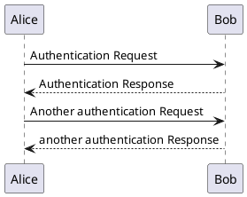

# メモ

- 概念モデル
  - 概念同士の関連図。それぞれの概念は属性と振る舞いを持つ。
- 仕様モデル
  - 概念モデルと実装モデルにはギャップ（動的分類や多重分類はJava等のオブジェクト指向言語でそのまま扱えない、概念とクラスが1対1になるとは限らない等）があるため、
    実装モデルへの落とし込み方（＝実装方針）を示すために作成するクラス図。ギャップに対してどのようなクラス群になるか、属性や振る舞いの割当がどうなるかを示せていれば良い。
    つまりギャップのない部分まで作成する必要はない（仕様モデルと実装モデルとの違い）。
    仕様モデルがあることにより、概念モデルから実装モデルへの実装方針が明確となり人によるバラツキが減るため、作業分担しつつ品質を確保できる。
- 実装モデル
  - クラス図。場合によっては仕様モデルと差異がない。

