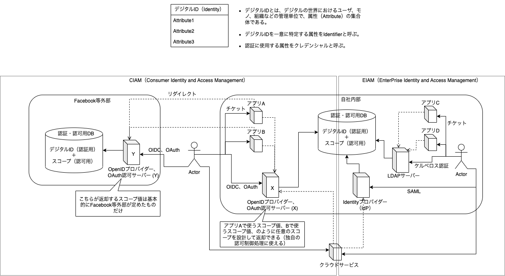

# 認証認可

## CIAM
- （画像左）自社アプリA,Bで、Facebook等外部の認証・認可DBを使用してSSO認証したい場合
  - 外部が提供するOpenIDプロバイダーやOAuth認可サーバーにリダイレクトさせてチケット発行させる。
  - ただし、チケットに記載されるスコープ値は通常は外部が定めた値になるため、自社アプリA、B等の認可制御用に使うことは避ける。
- （画像中央）自社アプリA,Bで、自社内部の認証・認可DBを使用してSSO認証したい場合
  - 内部に立てたOpenIDプロバイダーやOAuth認可サーバーにリダイレクトさせてチケット発行させる。
  - チケットに記載されるスコープ値も設計できるため、自社アプリの認可制御に使える。
  - そもそも全て自社内の話なのでOIDCとか気にせず好きに実装しても悪くない。ただし後述するクラウドサービスでの認証に対応できない。
- （画像中央）利用するクラウドサービスで、自社内部の認証・認可DBを使用してSSO認証したい場合
  - 内部に立てたOpenIDプロバイダーやOAuth認可サーバーにリダイレクトさせてチケット発行させる。
  - 画像にはルートを書いていないが、外部が提供するプロバイダーでもうまくいくはず。

## EIAM
- （画面右）自社アプリC,Dで、自社内部の認証・認可DBを使用してSSO認証したい場合
  - 内部にLDAPサーバー（ActiveDirectory等）を立てて、ケルベロス認証でチケット貰えば良い。
  - OIDCでもやりたいことはできる。CIAMとEIAMで標準化コミュニティが違っただけ。
- （画面中央）利用するクラウドサービスで、自社内部の認証・認可DBを使用してSSO認証したい場合
  - 内部に立てたIdentityプロバイダー（IdP）にリダイレクトさせてチケット発行させる。
  - OIDCでも、なんならケルベロスでもやりたいことはできる。今後はOIDCに寄せられていくと思われる。

# セキュリティ対策を講じる対象
- 1.マネジメント
- 2.エンジニアリング（ウェブ系）
  - 2.1 サーバーサイド
    - 2.1.1 アプリケーション（ウェブアプリ、ウェブAPI）
    - 2.2.2 インフラ（DNS、ルーター、ファイアウォール、L4・L7スイッチ、OS、ミドルウェア）
  - 2.2 クライアントサイド
    - 2.2.1 ブラウザ
    - 2.2.2 アプリ
    - 2.2.3 その他

**これらのDevOpsサイクルをセキュアに回さなければならない（＝DevSecOps）**

## 2.1.1 アプリケーション
アプリケーションに関するセキュリティ要件は以下が有名
- [OWASP-ASVS](https://github.com/OWASP/ASVS)
- [IPA 安全なウェブサイトの作り方](https://www.ipa.go.jp/security/vuln/websecurity.html)
  - [別冊：安全なSQLの呼び出し方](https://www.ipa.go.jp/security/vuln/press/201003_websecurity_sql.html)

# Remarks
|  要件  |  プロトコル・技術  |  実装  |
| ---- | ---- | ---- |
|  暗号化  |  共通鍵  |    |
|    |  公開鍵・秘密鍵  |    |
|    |  SSL/TLS  |    |
|  発信元保証・改竄防止  |  デジタル署名  |    |
|    |  JSON Web Token  |    |
|  認証  |  ID/パスワード認証  |    |
|    |  生体認証  |    |
|    |  多要素認証  |    |
|    |  FIDO  |    |
|  認可  |    |    |
|  SSO（認証）  |  OpenID Connect  |  Authlete,Keycloak,OpenAM  |
|    |  SAML  |  Keycloak,OpenAM  |
|    |  Kerberos  |  Keycloak,OpenAM  |
|  SSO（認可）  |  OpenID Connect  |  Authlete,Keycloak,OpenAM  |
|    |  OAuth  |  Authlete,Keycloak,OpenAM  |
