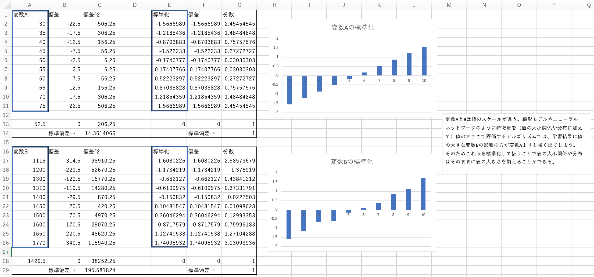
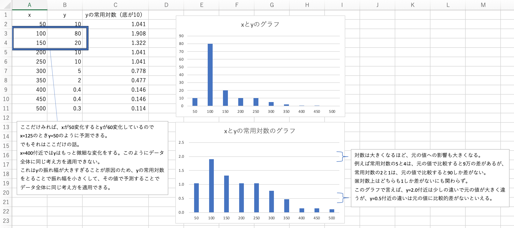
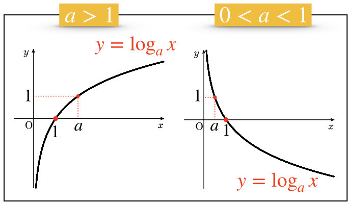

## 学習方法
様々なアプローチがある。
1. 誤差関数/尤度関数/事後分布などの目的関数の最適化問題に落とし込んで解く
2. 他

ここでは、1について説明する。  
最適化問題を解くとは、誤差関数を最小に、あるいは尤度関数や事後分布を最大にするパラメータを見つけることを指す。

最大化は、関数全体の符号を反転させれば最小化と同じことであり、 その「関数の最小点を見つける」ことをこの分野では「最適化」と呼ぶ。  

最適化の手法にはいくつか種類ある。
- 勾配法（勾配降下法）
  - 最急降下法（バッチ勾配降下法）
  - 確率的勾配降下法（SGD）
  - ミニバッチ勾配降下法
  - モーメンタム
  - RMSProp
  - Adam
- ニュートン法

ニューラルネットワークモデルの学習として、目的関数の最適問題を勾配法で解くとき、大量のパラメータを効率良く計算するために誤差逆伝播法と呼ばれる計算方法が用いられる。

### 勾配法
機械学習において、目的関数の最小にする入力値を求めるために人間のようにグラフを描画して最下点を求めることはできない。  
なぜならグラフを描くというは、考えられる全ての入力を目的関数に与えた結果をプロットすることであり、目的関数が多変数の場合膨大な計算を必要とするからである。  

勾配法では、適当な入力を与えて目的関数の傾きを確認し、傾きが大きい＝関数の最小点では無いというロジックで、徐々に入力値をずらして傾きが0となる入力値を探す方法である。

- ①目的関数を微分して導関数を求める。
  - 導関数は、ある入力値における元の関数の傾き（微分係数）を返す関数。
  - 目的関数が他変数関数の場合は、まずそれぞれの変数に関して偏微分した偏導関数を求める。
- ②現在の目的関数の入力値を、①の導関数に与えて傾きを算出する。
  - 多変数関数の場合は、各パラメータの偏導関数から求められた複数の傾きをまとめた「勾配」を求める。
- ③傾きが大きければ、傾きを小さくする方向に入力値をずらしたものを次の入力値として②に戻る。
  - 傾きを小さくする方向は、傾きの正負で判断する（1変数関数のグラフで言えば、正なら左、負なら右にずらす）。
  - 入力値をどのくらいずらすかは学習率ηによって決まる。
  - 傾きが最も0に近づいた入力値を採用し学習完了とする。


### 誤差逆伝播法
ニューラルネットワークで勾配法を行うときの、効率の良い計算方法のこと。

NNの目的関数は、NN内部の大量の重みとバイアスを変数とする多変数関数となるため、勾配法の計算を効率よく行う必要がある。

用意した学習データセット（例えば1000個）を、繰り返し何回使うかをエポック数と呼ぶ。以下は1エポックにおける勾配法の手順である。
- ①モデルのパラメータ（重みとバイアス）を初期値に設定
- ②学習データセットからバッチを用意する
  - 学習データセットの全ての学習データを1つのバッチに含める方法を最急降下法（バッチ勾配降下法）という。
  - 学習データセットの全ての学習データを分割して、少数の学習データで構成されるバッチに振り分ける方法をミニバッチ勾配降下法という。
  - 学習データセットからランダムに選んだ学習データ一つで構成されるバッチを、任意の数用意する方法を確立的勾配降下法（SGD）という。
- ③バッチ数分以下を繰り返す（この繰り返し回数をイテレーション数と呼ぶ）
  - ③-1.このバッチの学習が完了するまで以下を繰り返す（この繰り返し回数をステップ数と呼ぶ。1ステップはモデルのパラメータを1回調整することを意味する）
    - ③-1-a.バッチに含まれる学習データを全て実行
    - ③-1-b.各学習データで、全ての重みとバイアスに関する目的関数の傾きをまとめたベクトル（勾配）を算出する。
      - 連鎖律を用いて各パラメータに関する目的関数の導関数を求める。
      - 
      - 出力層から（逆から）計算することで、計算結果を再利用できる（ここが誤差逆伝播の由来）。
      - 
    - ③-1-c.各学習の目的関数の勾配を平均する。
      - 
    - ③-1-d.勾配平均値を小さくする方向に重みとバイアスをずらす。このとき勾配が0付近に収束していたらこのバッチの学習完了とする。
      - 
      - どの程度ずらすかを決める最適化アルゴリズム（Pytorchで言うオプティマイザ）には、ベーシックなのもの（前のパラメータから学習率*勾配分ずらすもの、PytorchではこれをSGDと言っている）から、モーメンタム、RMSProp、Adam等があり、今はミニバッチ勾配降下法+Adamの組み合わせが主流。

バッチサイズについて
- バッチサイズが大きい最急降下法などでは、学習データが大量のため、各学習データで得られた目的関数の勾配の特徴（値のメリハリ）が、他の多くの勾配と平均されて薄まっている。
  - そのため学習は全ての学習データの目的関数の勾配を下げる方向を見極めて進むものの、その分モデルの重みとバイアスの調整量が小さく、勾配の収束まで時間がかかる。重みとバイアスを変えるたびに全ての学習データについて目的関数の勾配を求め直すため計算量が多い。また、局所最適解に至ったときに抜け出しにくい（全ての学習データの勾配の平均を使っているため、エポック数を増やしても変りにくい）。
- バッチサイズが小さい確立的勾配降下法やミニバッチ勾配降下法などでは、少量の学習データのため、各学習データで得られた目的関数の勾配の特徴が、モデルの重みとバイアスの調整量に反映されやすい（1ステップでずらすパラメータサイズが大きい）。
  - そのため一つのバッチの学習完了は比較的早い。これをバッチ数分繰り返す。バッチ毎に新しい勾配平均値が算出されるため、局所最適解から抜け出しやすい。しかしパラメータの調整量が大きいことは、目的関数のPathological Curvature（鋭いくぼみを持つ形状）の間で振動して学習が進まない問題を引き起こすことがある。この対策として、モーメンタム、RMSProp、Adam等の近似アルゴリズムが使われる。
- 


## モデルのアーキテクチャ
### 形式ニューロン
実際のニューロン（神経）の活動をモデル化したもの。ピッツモデルとも呼ばれる。

  
- `h`： 閾値（（これをバイアスとしてbで説明するものもある）
- `xi`： 入力
- `wi`： 重み。
- `H`: ヘヴィサイドの階段関数（ステップ関数）と呼ばれ、閾値である0を超えていれば1、でなければ0を返却する。

### パーセプトロン
形式ニューロンの考え方をベースにした実装全般を指す。

- 単純パーセプトロン
  - 入力層と出力層の二層で構成されるパーセプトロン。文脈によるが、ステップ関数を用いた実装を指すことが多い。

- 多層パーセプトロン（MLP）
  - 入力層、中間層（隠れ層）、出力層の三層以上で構成されるパーセプトロン。ニューラルネットワークと呼ばれる。基本的なものでは、各層間に重みがあり、隠れ層では非線形関数による変換が行われ、出力層は（ステップ関数などは用いず）単に隠れ層の総和となる。
  - 
  - 再帰型ニューラルネットワーク（RNN）と呼ばれるものでは、中間層の演算を繰り返す。
  - 
  - 使い方としては、以下のように、ニューラルネットワークの処理を複数回行う中で、前回の中間層の演算結果を使った演算も追加で行うようにする。
  - 
  - これにより、時系列を持つデータを順番に（上図で言うと左から順に）ニューラルネットワークにかけることで、前回のデータを考慮した計算ができる。
  - 横展開する層を複数設けたものは多層RNNと呼ばれる。
  - ただし単純なRNNモデルでは「入力された情報を長期間保持できない」と指摘されている。これは過去から伝搬される情報が、再帰のたびに加算される演算結果によって「薄められる」からである。この対策としてLSTM（Long Short-Term Memory）というモデルが提案された（後述）。

理論上、多層にすることで、あらゆる入力と回答の組み合わせを一つの関数で実現可能（線形モデルの構造と比べればこれは明らか）なため人間の脳レベルの処理をできるが、そのために設定すべき隠れ層の数、重み、非線形関数のパラメータ等を導くロジックが複雑かつ膨大で、実質不可能であった。
しかし近年になって、ディープラーニングと呼ばれる機械学習アルゴリズムが開発され、それによって高い精度で設定できるようになってきた。

### ディープラーニング
主にニューラルネットワークベースのモデルを生成可能な機械学習アルゴリズムを指すが、抽象化して「対象の全体像から細部までの各々の粒度の概念を階層構造として関連させて学習する手法」とも定義される。

### LSTM（Long Short-Term Memory）
LSTMはRNNの一種で、通常のRNNが情報をそのまま次に引き継ぐのに対し、LSTMではメリハリをつけて（考慮する割合を調整して）引き継ぐ。

仕組みとしてはRNNのラッパーで、通常のRNNの動きに加えて、メモリセル`c`で表現される追加のデータ引き継ぎ処理や、その他の調整処理が行われている。これらはゲートという概念で説明される。  


- Forget Gate `gf`
  - 前時刻から伝搬されたメモリセルに対して適用する（成分ごとに積をとる）重みベクトル。これにより過去の情報を考慮する割合を調整する。
- Input Gate `gi`
  - 現在時刻の入力を考慮する割合を調整する。
- Output Gate `go`
  - 現在時刻の出力を、次時刻で考慮する割合を調整する。

それぞれのゲートは、シグモイド関数を適用した重みベクトルになっている（各成分が0〜1）。

### ベクトル
ベクトルは、プログラミングでいうところの数値の1次元配列である。（2次元配列はベクトルではなく行列になる）  
ただし、数学的には配列のサイズのことをベクトルの次元数として扱うので注意。例えば`[2,5,9]`は1次元配列だが3次元ベクトルである。

数学におけるベクトルの成分表示を、プログラミングの配列で行なっているだけで、つまりは数学的なベクトルと同じ概念を扱っている。  
従って、数学の法則を適用できる。

#### ベクトルのノルム
ベクトルの大きさを表す。ベクトルaのノルムは`∥a∥`と記載する。

ノルムには種類がある。  
`a＝(a1,a2)`のとき、

- L1ノルム
  - 成分の絶対値の和
  - `∥a∥ = |a1| + |a2|`
- L2ノルム（ユークリッドノルム）
  - ベクトルの絶対値
  - `∥a∥ = √(a1^2 + a2^2)`
  - ちなみに囲む縦線が左右一本ずつの`|a|`はベクトルaの絶対値を表すため、L2ノルムの場合`∥a∥ = |a|`となる。


#### ベクトルの内積
ベクトルには向きがある。  
特に2次元ベクトル（平面ベクトル）や3次元ベクトル（空間ベクトル）ではイメージしやすいが、始点をグラフの原点、終点をベクトル成分をグラフにプロットした点として、向きがある。

二つのベクトルa,bの内積は、なす角をθとしたとき`　a・b = a1b1 + a2b2 + ... = ∥a∥∥b∥cosθ`となる。

内積の意味は、`b`の`a`に対する仕事量である。`b`が`a`と同じ向きに大きなノルムを示すほど、内積は大きくなる。  
これはヨットがゴール方向とは少し異なる向きの風を受けながら、ゴールに向かう関係に例えることができる。


`cos0`は、0度で最大値1を取り、90度で0、それ以上の角度でマイナスの値を取る。  
（0度は風向きがゴール方向と全く同じ、90度は垂直、それ以上の角度は逆風）

つまり、`∥b∥cosθ`の部分で、`b`の`a`に対する貢献度が計算されている。

#### コサイン類似度
二つのベクトルがなす角のコサイン値のこと。  
内積の考え方と同じで、向きが全く同じで最大値1、真逆で最小値-1を取る。

公式は、内積の公式から導き出せる。

`　cosθ = a・b / ∥a∥∥b∥ = sim(a,b)`

ベクトル同士の類似性を評価する定量的な尺度として利用される。  

#### なぜベクトルとコサイン類似度を使うのか？
例えば、適当なベクトルを2つ作って、それらのコサイン類似度を測定することに意味はない。

似たデータを、コサイン類似度が大きくなるようにベクトル化することに意味がある。  
そうすれば、コンピュータにコサイン類似度を計算させて、それらが似たデータかどうか判断させることが出来る。

しかし実際、似たデータを判別するだけなら、ベクトルでなくとも単にデータを数値化して並べておき、数値が近ければ似ているとしても良い。  
だがこれは、大量のデータを扱おうとすると、表現力に乏しく失敗する。  
例えるなら、一つのフォルダに大量のファイルを、ファイル名連番で並べているようなものだ。似たファイルを近い番号にして集めていても、量が多いと似てるのか判断できなくなる。  

そこで、次元数を好きなだけ増やせるベクトルに白羽の矢が立った。  
例えるなら、フォルダの階層を好きに作れるため、似たファイルを集めたフォルダを作っておけるし、階層の深さや構造に意味をもたすこともできる。  

次元数が増えた分、似ているかどうかの判定基準が難しいが、そこにコサイン類似度を採用しているという関係である。    
もちろん他の判定基準を採用し、それを満たすようにベクトル化するというのも良い。

だが注意したいのは、そのベクトルの全ての次元の値を考慮した判定基準にしなければ、似た値を持つ他のベクトルとの区別が甘くなってしまう。  
よって結局のところ内積やコサイン類似度などを用いるのが一般的となる。

### ベクトル化（テキスト処理の文脈における）
入力としてテキストを受け取り、ベクトルを出力する処理を指す。  
ベクトル化によって、テキスト同士の数値比較が可能になる。数値の持つ意味（大きいと何なのか、近いと何なのか）はベクトル化ロジックによって変わる。  

単純なベクトル化ロジック`Bag of Words（BoW）`  
https://www.yakupro.info/entry/ml-bow

ディープラーニングを用いた`Word2Vec`  
https://qiita.com/Hironsan/items/11b388575a058dc8a46a


### 評価指標
- 回帰
  - RMSE（Root Mean Squared Error: 平均平方二乗誤差）
  - RMSLE（Root Mean Squared Logarithmic Error）
  - MAE（Mean Absolute Error）
  - 決定係数（R2）
- 二値分類〜正例か負例かを予測値とする場合
  - accuracy（正答率）
  - error rate（誤答率）
  - precision（適合率）
    - 正例と予測したもののうちの正解率。負例を正例と誤答したくないときに重要視する指標。正例と予測する判定を厳しくすればスコアは高くなる。
  - recall（再現率）
    - 正解が正例のもののうち、正例と予測できた割合。正例を取りこぼしたくないときに重要視する指標。正例と予測する判定を甘くすればスコアは高くなる。
  - F1-score
  - Fβ-score
  - MCC（Matthews Correlation Coefficient）
- 二値分類〜正例である確率を予測値とする場合
  - logloss
  - AUC（Area Under the ROC Curve）
- 多クラス分類
  - multi-class accuracy
  - multi-class logloss
  - mean-F1
  - macro-F1
  - micro-F1
  - quadratic weighted kappa
  - balanced accuracy
- レコメンデーション
  - MAP@K（Mean Average Precision）

### 目的関数
モデルが学習において分岐や係数の追加/削除の判断基準に使う関数のこと。評価指標と同じ関数を使うことがある（RMSEやloglossなど）。


### 調和平均
生産性や能力の平均を求めるときに使う。
```
aとbの調和平均 = 2 / （1/a + 1/b）
```
通常の平均（相加平均）は量を元に計算している（40個と60個の平均は50個）。

生産性や能力とは、単位あたりに出力できる量を表現している。例えば`5km/h`の能力は1時間あたり5kmを、`10km/h`の能力は1時間あたり10kmを出力できることを表している。

これらの能力の平均を求めるとする。ポイントはそれぞれの能力を発揮した時間の情報が無いこと、つまり出力量を算出できないため相加平均は使えない。そのため調和平均では、能力を単位と出力量に分解・セットにして考える。

※もし、能力を発揮した時間がわかっている場合は、先に出力量を算出して相加平均すれば良い。例えば`5km/h`で1時間、`10km/h`で1時間で移動したときの平均速度は`7.5km/h`で良い。

`5km/h`は1kmあたり1/5時間かかることを表す。`10km/h`の場合は1kmあたり1/10時間かかる。それぞれの能力を順に発揮したとすると、1/5 ＋ 1/10時間で2kmの結果を出したことになる。これを1つの能力とみなす（調和平均をとる）と`2 / (1/5 + 1/10) = 6.67`となる。　　

このように能力に関する計算は、量と単位に分解・セットにして考える必要がある。

平均を求める対象が能力の場合には、調和平均を用いることが正しく、それによってモデルの学習結果の向上が見込める。

### 線形変換
変数の分布は伸縮するだけで形状そのものは変わらない（乗算と加算のみによる変換）。

- 標準化  
平均を0、標準偏差を1にする線形変換のこと。
```
x' = (x - μ)/σ
```

分子と分母の単位が同じであれば、それは割合を表す。`30人/500人 ＝ 0.06 = 6%の人 = 3000人/50000人`

標準化は偏差を標準偏差で割っている（分子と分母の単位が同じ）ため、平均値からのバラつき率とも言える。
従って変換前の値の大小に関係なく（変数AでもBでも）`-2〜2`付近の値になる仕組み。

- 正規化  
全てのデータが0～1の間の大きさに変換すること。Min-Maxスケーリングともいう。

あるベクトルbに対して要素数を増やしたり減らしたりしたい、つまり線形変換を行いたい場合は、任意の行列Aを用いて`Ab`のように内積をとることで実現できる。  
この結果はAの行数分の要素を持つベクトルになるからである。


積を取るだけなので、bの各要素の関係性は変わらない（線形を保つ）。    

### 非線形変換
変数の分布の形状を変える。

- 対数変換

「ある値xの常用対数をとる」とは、底が10の対数関数log10x（10を何乗したらxになるか）の答えを採用することを意味する。
ちなみに底がネイピア数（e=2.718...）の対数関数は自然対数と呼ばれ、logではなくlnと表記して区別されることがある。  
底が省略されている場合、一般的にlog表記は常用対数、ln表記は自然対数と区別されるが、log表記でも自然対数が使われることもあるため注意。

底や真数が1より大きいかどうかによって値変化の特徴が変わるため、必要に応じて使い分ける。


- Box-Cox変換

- Yeo-Johnson変換
- generalized log transformation
- その他の非線形変換
  - 絶対値を取る
  - 平方根を取る
  - 2乗を取る、n乗を取る
  - 正の値かどうか、ゼロかどうかなどの二値変数とする
  - 数値の端数をとる
  - 四捨五入・切り上げ・切り捨て


### RankGauss
データを順位に変換した上で正規分布になるように変換する手法。ニューラルネットで良い性能を示す。元のデータが多峰であっても正規分布にできる。

