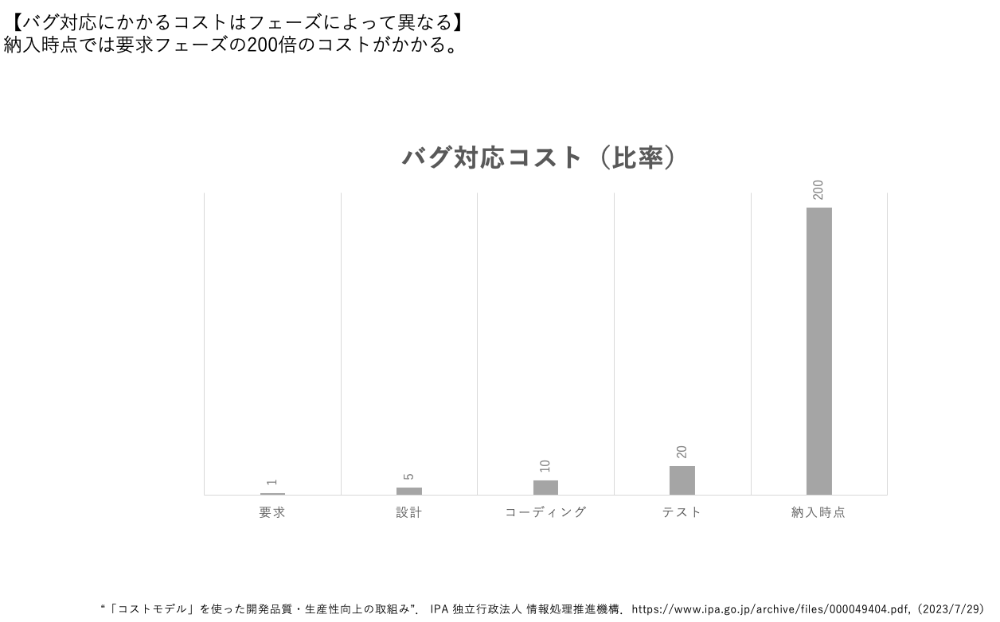

# What
- 要求
  - 「要求とは、何を実装しなければならないかという仕様である。また、システムがどう振る舞わなければならないかという記述であり、システム特性や属性の記述でもある。システムの開発プロセスに対する制約条件のこともある。」
  - 出資者、ステークホルダーの中にあり、生まれていくもの。

- 要求工学
  - 要求に投資を行い、ビジネス価値を最大化することを目的とする活動・研究分野。

- 要求開発
- 要求管理

# Why
なぜ、要求に価値を見出し、それに対して活動するのか？
要求に価値がないと判断したり、要求に対して活動しないとどうなるのか？

- （ビジネス価値が最大化されない的な）
  - アジャイル、ユーザー関与がないとどうなる、新しい発見がない、イノベーションがない、低いとこで着地、みたいな
  - 本当に必要なものに後から気づいた
  - ビジネス価値の最大化＝利益を生む、ビジネスで優位に立つ、差別化できる、ブルーオーシャン、
  - 利益を生めなかった
  - 他社との差別化ができない、他社に遅れをとった
  - 新しいアイデアが生まれない、あっても認識されずに終わる→差別化やブルーオーシャンの獲得チャンスを失う→デザイン思考
  - ユーザー体験の要求はユーザーしか持たない

- 開発コストが増加してしまう  
  -   

- 無駄な機能が作られる
  - 
  
- プロジェクトが中止に追い込まれる
  - 

- 価値を最大化できない
  - ユーザー要求（ユーザー体験）が価値をもたらす、重要である。ここを重視できなければビジネスで勝てない。国際規格すらある。

- プロジェクトの目標を達成したか判断できない
- スコープ調整が必要になったときのトレードオフを決定できない

# How
- 要求工学アクティビティを必要な分実施する
  - 　

- イテレーティブ・インクリメンタルに開発する
  - 分析マヒはダメ。ここに要求書いといたからやってね、では上手くいかない。最初から明確な要求を持っていることは少ない。小さく動くソフトウェアを作りながら要求を生み出していく。（こっちに不確実性コーン、UXでユーザーによるフィードバックを何度も行うプロセスが規格として定義されている）

- 一緒に開発する
  - そっちで要求定義してね、も上手くいかない（「ユーザーの主観的なもの」）
