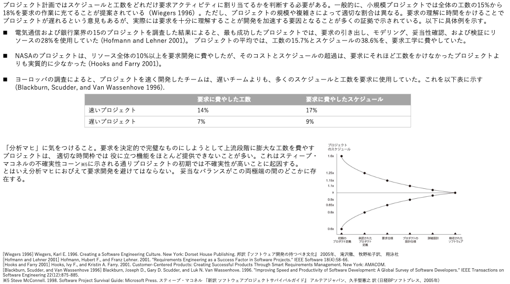

# What
- 要求
  - 「要求とは、何を実装しなければならないかという仕様である。また、システムがどう振る舞わなければならないかという記述であり、システム特性や属性の記述でもある。システムの開発プロセスに対する制約条件のこともある。」

- 要求工学
  - 要求に投資を行い、ビジネス価値を最大化することを目的とする活動・研究分野。

- 要求開発
- 要求管理

理想：要求がソフトウェアとして実現される。
現実：実現されない。

原因：顧客の頭の中にさえ、要求は最初から揃ってない、待ってれば揃うものでもない、

解決策：要求を引き出し、分析し、仕様を作成し、妥当性を確認し、管理する。
これらの具体的かつ効果的な方法を研究したり、実施したりする。

# Why
なぜ、要求に価値を見出し、それに対して活動するのか？
要求に価値がないと判断したり、要求に対して活動しないとどうなるのか？

- （ビジネス価値が最大化されない的な）
  - アジャイル、ユーザー関与がないとどうなる、新しい発見がない、イノベーションがない、低いとこで着地、みたいな
  - 本当に必要なものに後から気づいた
  - ビジネス価値の最大化＝利益を生む、ビジネスで優位に立つ、差別化できる、ブルーオーシャン、
  - 利益を生めなかった
  - 他社との差別化ができない、他社に遅れをとった
  - 新しいアイデアが生まれない、あっても認識されずに終わる→差別化やブルーオーシャンの獲得チャンスを失う→デザイン思考
  - ユーザー体験の要求はユーザーしか持たない

- 開発コストが増加してしまう  
  -   

- プロジェクトが中止に追い込まれる
  - 

- 価値を最大化できない
  - 
  - 要求の一種であるユーザー要求は、「ユーザ体験（UX）」とも言われている。toBでもtoCでも、価値はユーザーが決めている。大切なのはユーザー体験（UX）。これは実際の利用環境におけるユーザーの理想的な体験のこと。
  - ユーザー体験は要求であり「ユーザーの主観的なもの」であり、提供側が決めるものではない。つまりユーザーを巻き込まないと話にならない（だから？）。実際にISOから人間中心設計の国際規格が発表された。

- プロジェクトの目標を達成したか判断できない
- スコープ調整が必要になったときのトレードオフを決定できない

# How
- 要求工学アクティビティに時間を確保する
  - 　＋ ここに要求書いといたからやってね、では上手くいかない（不確実性コーンと、後はUXで実際の利用環境でしか価値がわからない、ユーザーによるフィードバックを何度も行うプロセスが規格として定義されている（多分）ということが根拠になるかも）

- イテレーティブ・インクリメンタルに開発する
  - 最初から明確な要求を持っていることは少ない。小さく動くソフトウェアを作りながら要求を生み出していく。

- 要求工学のプラクティスを実践する
